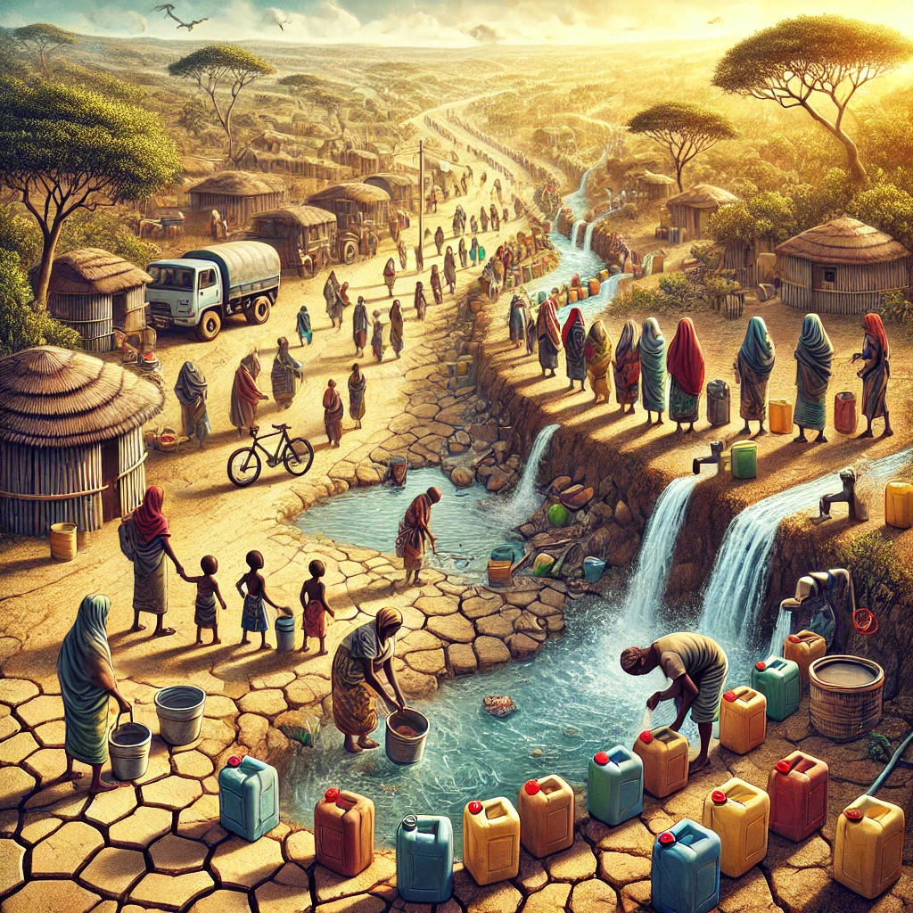
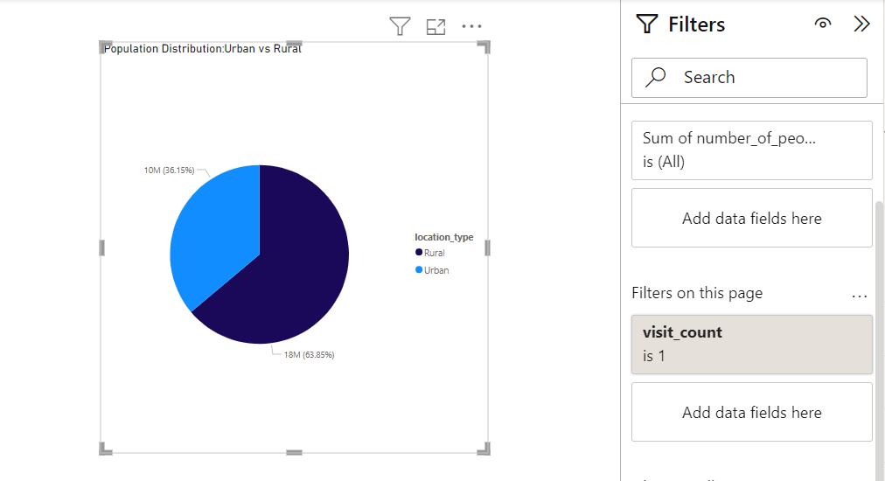
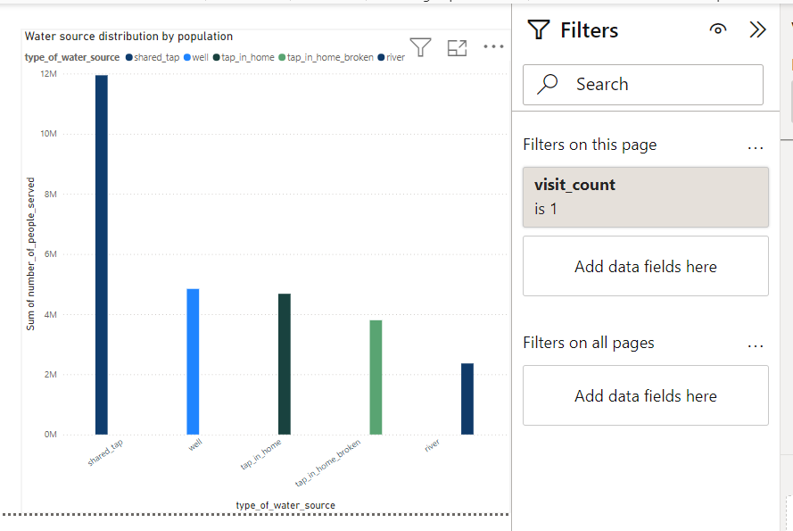
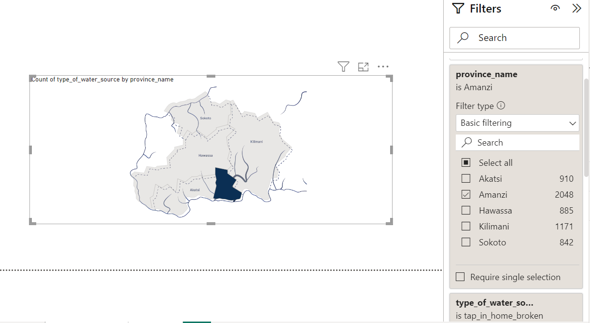
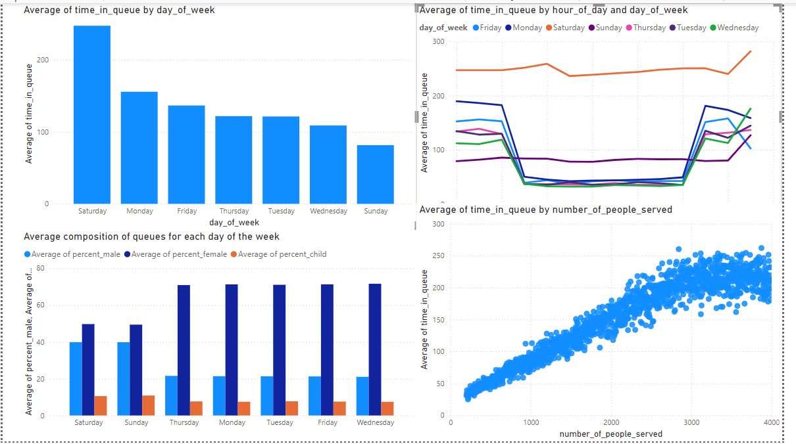
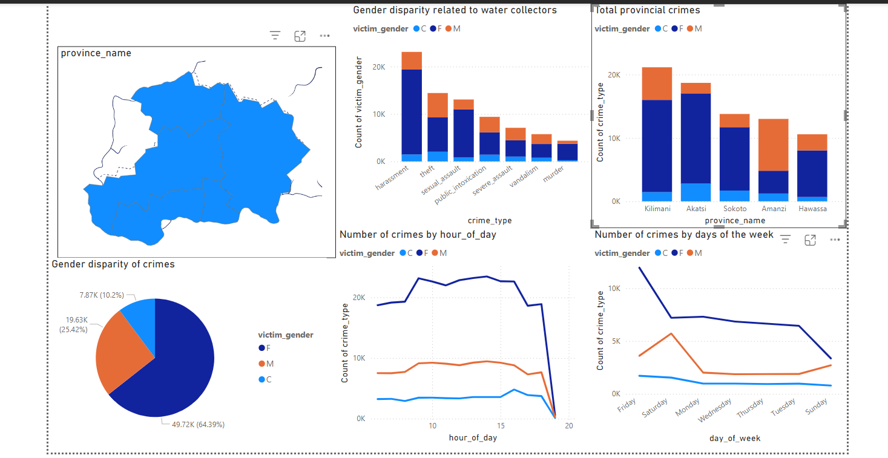

# Visualizing Maji Ndogo's Past

## Introduction

This Power BI visualization explores gender parity in access to water and the challenges of water collection in the fictional state of Maji Ndogo. In Maji Ndogo, water collection is a daily necessity, with most residents relying on various water sources early in the morning and late in the evening. Unfortunately, these times coincide with increased vulnerability to crimes, especially for women, who often bear the burden of water collection. This project aims to highlight the disparities between men and women in water access, while shedding light on the risks and challenges they face. By analyzing gender-specific data, this visualization seeks to inform better decision-making and encourage solutions for safer, more equitable access to water.

**_Disclaimer_**:_ All datasets and reports do not represent any company, institutions or country but just a fictional dataset to demonstrate the capabilities of power BI

## Problem Statement
1. How are water sources distributed across Maji Ndogo?
2. Which province made the most progress towards gender equality in regard to access to water?
3. What is the average gender composition of queues in each town?
4. What are the patterns in gender composition within queues over various days?
5. What is the gender-based distribution of crimes committed against victims?

## Power BI concepts demonstrated
- Modelling
- Filters
- Visualization

## Data Sourcing
Downloaded the csv files from ALX Explore AI Course and extracted it into power bi for cleaning, analysis and visualization.
Data used in this project:

[Md_summary.csv](https://github.com/lisaogeya/Gender-Inequality-IN-Water-Access/blob/main/Md_summary.csv)

[Md_queue_related_crime.csv](https://github.com/lisaogeya/Gender-Inequality-IN-Water-Access/blob/main/Md_queue_related_crime.csv)

## Data Modelling

No modelling is required since we just need tables for analysis

## Analysis and Visualizations
**VISUALIZING MAJI NDOGO'S PAST**

Population Distribution                  |                    Water-Source Distribution
:--------------------------------------: | :------------------------------------:       
         |      

**_Insights_**

- Majority of the population lives in the Rural areas of Maji Ndogo.
- Among the various water sources, shared taps are the most commonly used while rivers are the least prferred.

**Water-Source Distribution by Province**

**_Insights_**
- Amanzi Province is our top priority due to the high number of broken taps in residential areas.

**Queue Composition**

**Insights**

- From the queue times per day bar chart we can see that Saturdays have very long queues 😟.
- According to the queue times per hour chart, during the week, people typically queue either early in the morning or late in the afternoon,  before or after work.
- On weekends, people tend to queue more consistently throughout the day.
- If people have to queue on a Saturday, 11 AM to 18:00 AM has 15% shorter queues.
- In the clustered bar visual, women queue for water significantly more than men, but the gap between men and women noticeably decreases over the weekend.
- In the scatter plot ,the queue times don't increase much past 3000 because people see long queues and go look for water in other places.

**Crimes against residents of Maji Ndogo**

**Insights**
From the visualization above we idenitfy the following trends:
- As water collectors, women are twice as likely to be a victim of crime than men
- Woman are most likely to be victims of harrasment followed by sexual assault.
- Crime spikes over weekends and almost twice as many crimes are committed early in the mornings or at night with women facing the greatest threat.
- Kilimani province has the highest number of crimes against women while Amanzi has the lowest.

  
