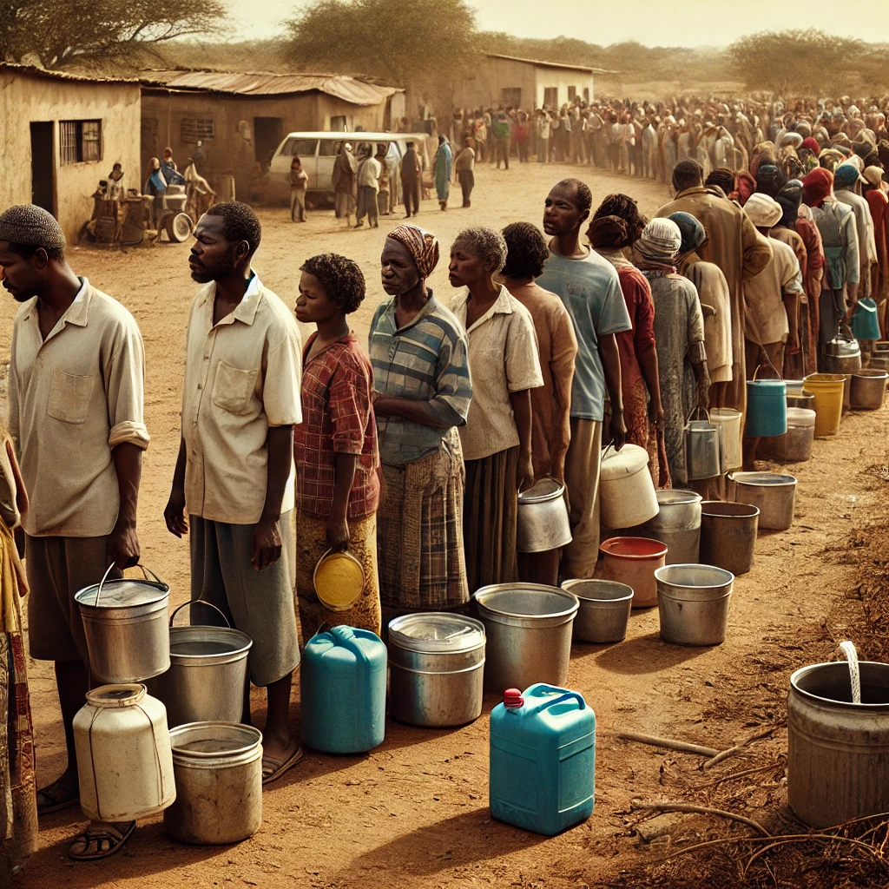
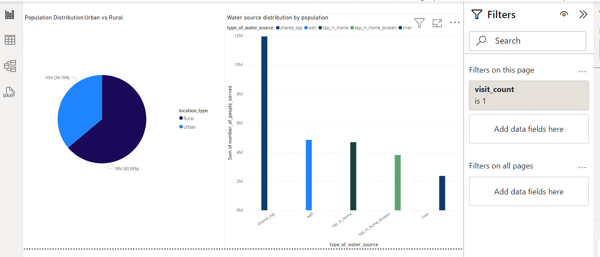

# Gender-Inequality-IN-Access-to-Water

## Introduction

This is a Power Bi project on the gender dynamics in water collection of an imaginary country called **Maji Ndogo**.
The project aims to analyze and derrive insights to 

**_Disclaimer_**:_ All datasets and reports do not represent any company, institutions or country but just a fictional dataset to demonstrate capabilities of power BI_

## Problem Statement
1. How are water sources distributed across Maji Ndogo?
2. Which province made the most progress towards gender equality in regard to access to water?
3. What is the average gender composition of queues in each town?
4. What are the patterns in gender composition within queues over various days?
5. What is the gender-based distribution of crimes committed against victims?

## Power BI concepts demonstrated
- Modelling
- Filters
- Visualization

## Data Sourcing
Downloaded the csv files from ALX Explore AI Course and extracted it into power bi for cleaning, analysis and visualization.
Data used in this project:

[Md_summary.csv](https://github.com/lisogeya/Gender-Inequality-IN-Water-Access/blob/main/Md_summary.csv)

[Md_queue_related_crime.csv](https://github.com/lisogeya/Gender-Inequality-IN-Water-Access/blob/main/Md_queue_related_crime.csv)

## Data Modelling

No modelling is required since we just need tables for analysis

## Analysis and Visualizations

- Majority of the population lives in the Rural areas of Maji Ndogo.
- Among the various water sources, shared taps are the most commonly used while rivers are the least prferred.
- 

  
